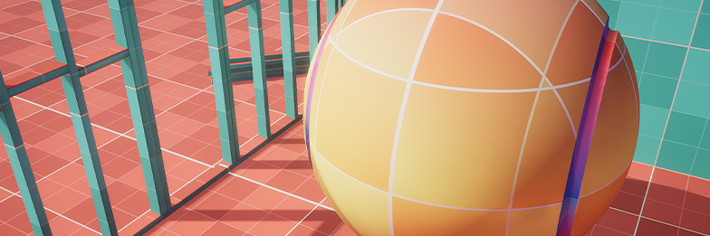

# unity-grid-shader
A procedural, world-space grid shader for level blockouts. Created by Nick Mower in Unity 2021.2.6f1.

Full tutorial can be found here: https://www.techarthub.com/unity-grid-shader/
